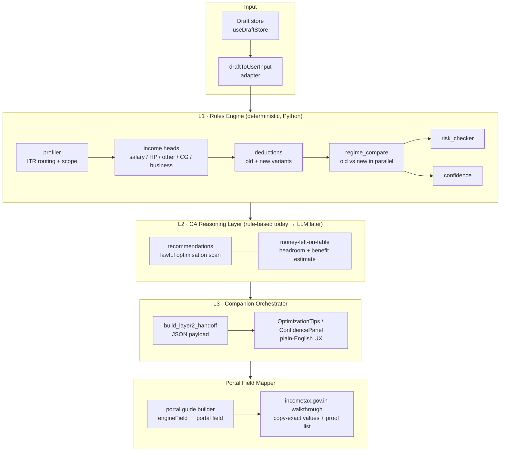
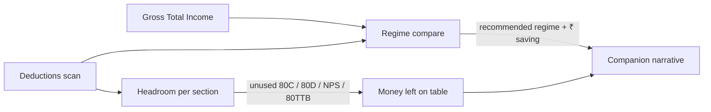
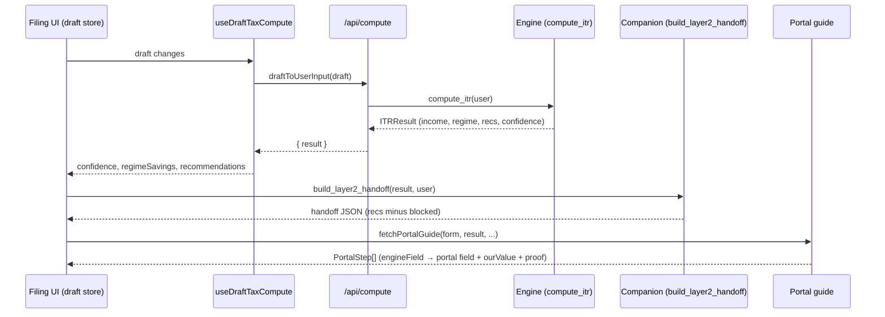
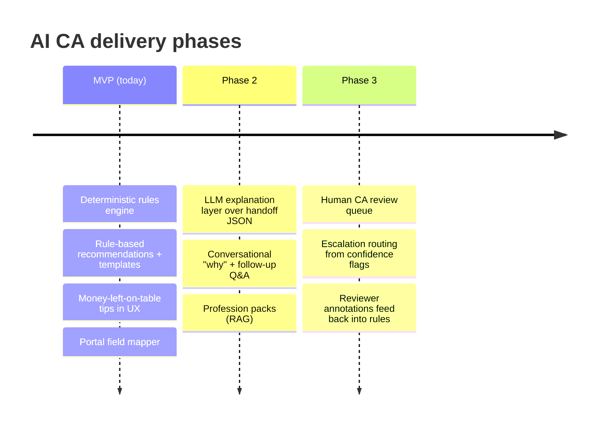

# 05 — AI CA Architecture (Workstream A: Engine & AI CA)

> **Vision.** The engine + UX should feel like a personal CA friend who (1) finds the
> maximum *lawful* refund, (2) explains the tradeoffs in plain English, and (3) hands off
> the exact incometax.gov.in portal instructions. No black boxes, no risky "hacks", and
> never a guarantee we can't stand behind.

---

## 1. Target architecture

The system is layered so that each layer has one job, fails safe, and can be shipped
independently. Layers below are deterministic; layers above add reasoning and language.

**Layer responsibilities**

| Layer | Owns | Determinism | Failure mode |
| --- | --- | --- | --- |
| L1 Rules engine | Tax maths, slabs, caps, regime tax, ITR routing | Pure / deterministic | Raise `ValueError` on out-of-scope → UX shows estimate fallback |
| L2 CA reasoning | "What lawful moves are left?", benefit sizing, risk labels | Rule-based today; LLM-explained later | Returns empty list → UX degrades to numbers only |
| L3 Companion orchestrator | Turns engine output into a friendly narrative + the handoff JSON | Presentational | Falls back to draft-derived confidence (`fallbackConfidenceFromDraft`) |
| Portal field mapper | Maps each engine field to an exact portal field + proof | Deterministic table | Locks export when mismatches unresolved |

---

## 2. How the three CA capabilities work together

The "personal CA" feeling comes from three engine outputs that are computed once and
then composed by the companion layer.

1. **Regime compare** (`regime_compare.py`) runs old and new regimes in parallel,
   returns `recommended_regime`, `tax_saving`, and `breakeven_deductions`. This answers
   *"which regime is cheaper and by how much?"*.
2. **Deductions scan** (`deductions.py` + `recommendations.py`) computes what was claimed
   vs. each statutory cap. Each gap becomes a recommendation with a `gov_section` and an
   `estimated_benefit` ≈ `gap × marginal_rate × 1.04` (cess).
3. **"Money left on the table" alerts** are the subset of recommendations where
   `risk == "green"`, `blocked == False`, and `estimated_benefit > 0`. They are only
   shown when the **old regime is recommended**, because new-regime filers can't claim
   most Chapter VI-A deductions — surfacing them would be misleading.

The companion narrative is therefore: *"You're on the {regime} regime, saving ₹X. You
still have ₹Y of lawful headroom under {sections} if you have the proof."*

---

## 3. AI CA persona principles

These are product-constitution rules, enforced in code today via `recommendations.py`
risk labels and the handoff filter (`if not r.blocked`).

1. **Plain English first.** Every recommendation carries a `plain_english` string written
   for a non-expert. The section number is supporting evidence, not the headline.
2. **Never guarantee.** Copy uses "you may claim", "estimated", "if ITD accepts". Refund
   figures are always framed as *estimates* (`is_estimate_mode`, "if ITD accepts").
3. **Lawful only, proof-backed.** Every green tip lists `proof_required`. Risky patterns
   (HRA with no rent, expenses > 90% of receipts) are `blocked` and never reach the UI or
   the handoff.
4. **Cite the section when it helps trust, not to show off.** `gov_section` is shown as a
   small tag, not in the sentence body.
5. **Confirm before claiming.** Anything ambiguous sets `requires_user_confirmation` so
   the user actively opts in with proof.
6. **Escalate honestly.** When `confidence.ca_escalation_recommended` is true, we say so
   and offer human CA review rather than pretending the bot is sufficient.

---

## 4. Data flow: draft → compute → companion field map

Key contracts already in the repo:

- `ITRResult.recommendations: Recommendation[]` — the CA reasoning output.
- `build_layer2_handoff(...).recommendations` — same list, **blocked items stripped**, the
  contract the LLM layer (Phase 2) will consume.
- `PortalStep.engineField` — the join key between a computed value and a portal field. This
  is where `portalFieldHints` (see roadmap) would attach a recommendation to a field.

---

## 5. Phased roadmap

### MVP — rules + templates (shipped / shipping now)
- `compute_itr` produces income, regime comparison, deductions, risk, confidence.
- `generate_recommendations` produces templated, section-cited, proof-backed tips.
- **This workstream adds:** surfacing those tips in the UX (`OptimizationTips`) so the
  "money left on the table" capability is visible, not just computed.
- Portal field mapper turns numbers into copy-exact portal steps.

### Phase 2 — LLM explanations (no new tax logic)
- The LLM consumes `build_layer2_handoff` JSON **only** — it explains and answers
  follow-ups; it never invents numbers or new deductions.
- Guardrails inherited from persona principles: never guarantee, lawful-only, cite section.
- Adds conversational "why is old better for me?" and profession-specific prompts using the
  existing `PROFESSION_PACK_*` recommendation hooks.

### Phase 3 — CA review queue
- `confidence.ca_escalation_recommended` + risk flags route a return to a human CA.
- Reviewer decisions are captured as structured corrections that tune L1/L2 rules — closing
  the loop so the "AI CA" gets measurably better, not just chattier.

---

## 6. Quick win implemented in this workstream

Engine recommendations were fully computed but **never rendered**. This workstream adds a
companion-style `OptimizationTips` panel (estimated refund + top 3 lawful tips, sorted by
benefit, green/non-blocked only, shown only when old regime is recommended) on the risk
review screen. Minimal diff, no engine changes — see `components/filing/OptimizationTips.tsx`.
