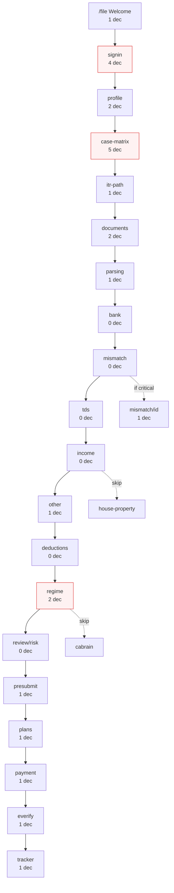
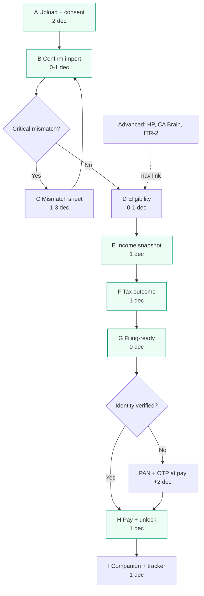

# UX Improvement Plan — LastMinute ITR

**Date:** June 2026  
**Researcher:** UI/UX audit vs plan + competitor wedge  
**Feedback:** Deployed site reads as a basic college/university site, not premium fintech (Quicko/ClearTax tier)

---

## Phase 3 — UX Journey Simplification (Agent 2)

**Goal:** Reduce cognitive load ~50% for the salaried ITR-1 happy path.  
**Method:** Challenge every screen — remove, merge, AI auto-complete, or skip.  
**Scope:** Docs only; routes audited under `app/file/**` + `itr-filing-wireframes/USER_FLOWS.md`.

### Executive summary

| Metric | Current (salaried ITR-1 happy path) | Proposed |
|--------|--------------------------------------|----------|
| **Screens visited** | 20 of 25 routes | **11** |
| **Screens eliminated / auto-skipped** | — | **14** (9 removed from path, 5 merged) |
| **Decision points** | **22** | **≤13** (10 core + up to 3 conditional) |
| **Onboarding before first upload** | 5 screens | **0** (import-first) |

**Key merges:** Welcome + sign-in deferred → `case-matrix` + `itr-path` + `profile` → **Eligibility**; `parsing` + `bank` → **Confirm import**; `income` + `other` → **Income snapshot**; `deductions` + `regime` → **Tax outcome**; `plans` + default → **Pay & unlock**; `presubmit` e-verify + `everify` → **Tracker**.

---

### Current flow map (25 route screens → 22 wireframe frames)

Shipped routes (`app/file/**`, excluding `layout.tsx`): **25 screens**. Wireframes (`USER_FLOWS.md`) define **22 canonical frames** (01–22). Extra shipped screens: standalone Welcome (`/file`), Payment, E-verify, Companion entry, Support.

| # | Route | Wireframe | Macro step | Decisions on screen | Happy-path salaried |
|---|-------|-----------|------------|---------------------|---------------------|
| 1 | `/file` | 01 Welcome | — | **1** — Start vs Companion | 1 |
| 2 | `/file/onboarding/signin` | 02 Sign in | Understand | **4** — PAN, mobile, OTP, consent | 4 |
| 3 | `/file/onboarding/profile` | 03 Profile | Understand | **3** — AY (fixed), residential status, age band | 2 |
| 4 | `/file/onboarding/case-matrix` | 04 Income radar | Understand | **5+** — income band, age, business type, income chips (multi) | 5 |
| 5 | `/file/onboarding/itr-path` | 05 ITR path | Understand | **1** — confirm recommended form | 1 |
| 6 | `/file/import/documents` | 06 Document hub | Import | **2+** — 3 start modes, connector uploads | 2 |
| 7 | `/file/import/parsing` | 07 Parsed confirm | Import | **2** — confirm vs edit, re-upload | 1 |
| 8 | `/file/import/bank` | 08 Bank | Import | **0–3** — account/IFSC/address (often pre-filled) | 0 |
| 9 | `/file/import/mismatch` | 09 Mismatch center | Reconcile | **0–3** — per-row fix / proof / guide | 0 |
| 10 | `/file/import/mismatch/[id]` | 10 Mismatch detail | Reconcile | **1** — mark resolved | 0 |
| 11 | `/file/import/tds` | 11 TDS matcher | Reconcile | **0–2** — advance tax, SAT | 0 |
| 12 | `/file/income` | 12 Salary | Optimize | **0–1** — add second Form 16 | 0 |
| 13 | `/file/house-property` | 13 House property | Optimize | **3+** — type, municipal tax, ownership %, HRA modal | 0 (skip) |
| 14 | `/file/other` | 14 Other sources | Optimize | **1** — FD / bank interest | 1 |
| 15 | `/file/deductions` | 15 Deductions | Optimize | **0–2** — 80GG input, proof uploads | 0 |
| 16 | `/file/regime` | 16 Regime | Optimize | **2** — pick Old/New + confirm CTA | 2 |
| 17 | `/file/cabrain` | 17–18 Profession / RAG | Optimize | **0–2** — profession pick, NPS yes/no | 0 (skip) |
| 18 | `/file/review/risk` | 19 Risk review | Review | **0** — read-only + continue | 0 |
| 19 | `/file/review/presubmit` | 20 Pre-submit | Review | **1** — e-verify method | 1 |
| 20 | `/file/checkout/plans` | 21 Plan | File & Track | **1** — plan tier | 1 |
| 21 | `/file/checkout/payment` | (part of 21) | File & Track | **1** — pay | 1 |
| 22 | `/file/checkout/everify` | (part of 22) | File & Track | **1–2** — method + complete | 1 |
| 23 | `/file/checkout/tracker` | 22 Tracker | File & Track | **1** — e-verify CTA | 1 |
| 24 | `/file/companion` | — (entry) | — | **1** — ITR form selector | 0 (off path) |
| 25 | `/file/support` | — | File & Track | **0–3** — support channels | 0 (optional) |

**Decision point definition:** Any choice, input, or explicit confirmation that changes filing data or gates progress (excludes pure “Continue” on read-only summaries).

**Current salaried ITR-1 happy path totals**

- Screens visited: **20** (skips house-property, cabrain, mismatch detail; includes welcome, payment, everify)
- Decision points: **22** (see column sum for happy-path row)
- Mismatch-block path adds: **+3–5** decisions (fix source, proof, re-reconcile)

**Cognitive load drivers (why 22 feels like 40+)**

1. **Questions before value** — 5 onboarding screens (~12 decisions) before Form 16 upload.
2. **Duplicate axes** — age band asked on Profile and Case matrix; ITR form asked on itr-path and again on Companion.
3. **Income workspace fragmentation** — salary, house property, other, deductions, regime as separate stops though Form 16 + AIS already contain most answers.
4. **E-verify asked twice** — presubmit dropdown + everify screen + tracker CTA.
5. **Plan choice before user has seen companion value** — 4 tiers when salaried ITR-1 maps cleanly to one paid SKU.

---

### Proposed simplified flow (salaried ITR-1, ≤13 decisions)

**Principle:** Import-first (ClearTax/TurboTax interview). Infer eligibility from documents. One question per beat on mobile. Pay after filing-ready score.

| Step | Proposed screen | Route (new or merged) | Decisions | Notes |
|------|-----------------|----------------------|-----------|-------|
| A | **Upload & consent** | Landing or `/file/import/documents` | **2** — upload Form 16 (+ optional AIS), inline DPDP consent | Skip Welcome when `?source=form16` or name on landing |
| B | **Confirm import** | Merge `parsing` + `bank` | **1** — confirm summary (auto-continue if ≥95% confidence) | Bank/address from PAN; refund account validated async |
| C | **Mismatch gate** | `mismatch` (inline cards, no separate list page when 0 critical) | **0–3** — only if critical/warning rows | Detail sheet modal, not full route hop |
| D | **Eligibility** | Merge `profile` + `case-matrix` + `itr-path` | **0–1** — age band if not inferable from docs | Auto ITR-1; show banner only if STCG/foreign flags |
| E | **Income snapshot** | Merge `income` + `other` + skip `house-property` | **1** — confirm FD interest from AIS | Salary read-only from Form 16 |
| F | **Tax outcome** | Merge `deductions` + `regime` | **1** — Old vs New regime (deductions pre-filled) | 80C/80D from Part B; 80TTB auto for seniors |
| G | **Filing-ready** | Merge `review/risk` + `review/presubmit` | **0** — confidence % + checklist; no separate e-verify pick | Default Aadhaar OTP |
| H | **Pay & unlock** | Merge `plans` (default SKU) + `payment` | **1** — pay (PAN + mobile OTP gate here if not signed in) | +2 decisions if identity not yet verified |
| I | **Companion + tracker** | Merge `companion` + `tracker` + `everify` | **1** — e-verify on portal when ready | Portal guide is the paid deliverable |

**Proposed happy-path totals**

- Screens: **11** (A–I; C conditional)
- Decision points: **10** without mismatch or identity gate; **≤13** with one mismatch fix + PAN/OTP at pay

| # | Decision | Required? | AI / default |
|---|----------|-----------|--------------|
| 1 | Upload Form 16 | Yes | Pre-select from landing CTA |
| 2 | DPDP consent | Yes | Single checkbox on upload screen |
| 3 | Confirm parsed summary | Yes if low confidence | Auto-skip if all fields high confidence |
| 4 | Resolve critical mismatch | Conditional | AI suggests source + one-tap “Use Form 16” |
| 5 | Age band (senior / super-senior) | Conditional | Infer from PAN DOB when available |
| 6 | Confirm FD / bank interest | Yes if AIS shows interest | Pre-filled from AIS |
| 7 | Choose tax regime | Yes | Pre-select cheaper regime from engine |
| 8 | PAN + mobile OTP | At pay/export | Defer from screen 02 |
| 9 | Pay (default plan) | Yes for companion | Default “Self-file + AI” for ITR-1 |
| 10 | E-verify on tracker | Yes post-submit | Default Aadhaar OTP; no presubmit dropdown |

---

### Screen merge / remove table (before → after)

| Before (route) | After | Action | Rationale |
|----------------|-------|--------|-----------|
| `/file` Welcome | — | **Remove from happy path** | Landing captures name + `?source=form16` → import |
| `/file/onboarding/signin` | Pay gate (H) | **Defer** | No account before value; OTP when exporting/paying |
| `/file/onboarding/profile` | Eligibility (D) | **Merge** | AY fixed; residential default Resident; age only if needed |
| `/file/onboarding/case-matrix` | Eligibility (D) | **Merge** | Infer band/chips from Form 16 + AIS |
| `/file/onboarding/itr-path` | Eligibility (D) | **Merge** | Auto ITR-1 for salaried; block banner only on conflict |
| `/file/import/documents` | Upload (A) | **Simplify** | Single primary CTA: Form 16; collapse ITD OAuth |
| `/file/import/parsing` | Confirm import (B) | **Merge** | One scrollable confirm |
| `/file/import/bank` | Confirm import (B) | **Merge** | Bank row in same summary |
| `/file/import/mismatch/[id]` | Mismatch gate (C) | **Merge UI** | Bottom sheet / modal, not navigation |
| `/file/import/tds` | Confirm import (B) or auto | **Skip** | Green TDS → no screen; red → inline on mismatch |
| `/file/income` | Income snapshot (E) | **Merge** | Salary card + other sources one screen |
| `/file/house-property` | — | **Skip** | “No rent / self-occupied” default; link in Advanced |
| `/file/other` | Income snapshot (E) | **Merge** | FD interest inline |
| `/file/deductions` | Tax outcome (F) | **Merge** | Show deductions under regime cards |
| `/file/regime` | Tax outcome (F) | **Merge** | Regime is the only user choice on screen |
| `/file/cabrain` | — | **Skip** | Salaried ITR-1; link “Complex case?” in nav |
| `/file/review/risk` | Filing-ready (G) | **Merge** | Confidence bar + checklist |
| `/file/review/presubmit` | Filing-ready (G) | **Merge** | Drop duplicate e-verify picker |
| `/file/checkout/plans` | Pay & unlock (H) | **Default** | One SKU pre-selected; “Compare plans” link |
| `/file/checkout/payment` | Pay & unlock (H) | **Merge** | Summary + Razorpay on one screen |
| `/file/checkout/everify` | Companion + tracker (I) | **Merge** | E-verify CTA lives on tracker |
| `/file/checkout/tracker` | Companion + tracker (I) | **Merge** | Tabs: Portal guide · Return status |
| `/file/companion` | Companion + tracker (I) | **Merge** | Paid unlock; not pre-filing entry |
| `/file/support` | Tracker footer | **Keep optional** | Link from tracker, not stepper |

**Screens eliminated from happy path:** 14  
**Net screen count:** 11 (9 always + mismatch conditional sheet)

---

### AI auto-complete opportunities (per current screen)

| Screen | Auto-complete opportunity | Confidence gate |
|--------|---------------------------|-----------------|
| Welcome | Skip entirely when landing params present | `name` or `source=form16` |
| Sign-in | PAN from prior session; OTP only at pay | After first successful verify |
| Profile | Residential = Resident; AY = current FY | Always for MVP AY |
| Case matrix | Income band from gross salary; chips from Form 16/AIS | ≥90% parse confidence |
| ITR path | `ITR-1` + auto-confirm for salaried-only signals | No STCG/foreign/director |
| Documents | Pre-select “Upload Form 16”; queue AIS/26AS async | Salaried path |
| Parsing | Auto-accept high-confidence fields; flag only 3 lows | Per-field confidence score |
| Bank | IFSC/account from AIS/PAN; validate in background | AIS bank section |
| Mismatch | Suggest “Trust Form 16” with one tap; pre-fill draft | Rule `MISMATCH_SALARY_001` |
| TDS | Auto-match 26AS; hide screen when green | TDS delta = 0 |
| Income | Full salary schedule from Form 16 Part B | Parse complete |
| House property | Default self-occupied, zero loss | No rent chip / no AIS rent |
| Other | FD interest from AIS; senior → 80TTB hint | AIS interest rows |
| Deductions | 80C/80D from Form 16 Part B; block invented patterns | Part B totals |
| Regime | Pre-select cheaper regime; show ₹ delta | L1 engine output |
| CA Brain | Skip entirely for ITR-1 simple path | `filingPath=simple` |
| Risk review | Auto-compute filing-ready % | Engine + mismatch state |
| Pre-submit | Auto checklist from draft; default e-verify | All green → no inputs |
| Plans | Map ITR-1 → `ai_smart` default | Form + chip profile |
| Companion | ITR form from `recommendedForm`; steps from engine | No manual form picker |

---

### Smart defaults by persona path

#### Salaried ITR-1 (Priya — USER_FLOWS Flow 1)

| Field / flow | Default |
|--------------|---------|
| `filingMode` | `exact` after Form 16 upload |
| `filingPath` | `simple` |
| `recommendedForm` | `ITR-1` (silent) |
| Residential status | `resident` |
| Age band | Infer from PAN; ask only if missing |
| Income chips | `salary` + `fd_interest` if AIS shows interest |
| House property | Skipped (self-occupied assumed) |
| Deductions | 80C/80D from Part B |
| Regime | Engine `recommended_regime` pre-selected |
| Plan | `ai_smart` (₹899) pre-selected |
| E-verify | `aadhaar_otp` |

#### Senior citizen / pensioner (USER_FLOWS — pensioner row)

| Field / flow | Default |
|--------------|---------|
| Age band | `senior` or `super_senior` from PAN DOB |
| Income chips | `pension` + `fd_interest` |
| Form | ITR-1 if only pension + interest |
| **80TTB** | Auto-apply up to ₹50k on interest (show in Tax outcome) |
| **80D** | Higher limit banner (₹50k family) pre-applied if health premium in AIS |
| Regime | Often Old cheaper — still show comparison, larger numbers |
| UI | Single-column; no income chip grid — “Pension + bank interest detected” |
| Plan | Same `ai_smart`; companion highlights senior exemption lines |

#### Investor / ITR-2 lite (USER_FLOWS Flow 3)

| Field / flow | Default |
|--------------|---------|
| Trigger | AIS STCG or capital_gains chip |
| Form | Block ITR-1 → recommend **ITR-2 lite** |
| Extra screen | **One** broker statement upload (not full case matrix) |
| Regime | Required decision (often Old) |
| Plan | `ai_smart` or `ca` if ESOP/RSU |
| Skip | House property unless rent chip |

#### CA Brain path (engineer / doctor — Flow 4)

| Field / flow | Default |
|--------------|---------|
| Entry | “My case is complex” from nav — not onboarding |
| Screens added | `cabrain` profession + 1–2 RAG questions max |
| Do not merge | Profession-specific logic stays off happy path |

---

### Mobile-first flow notes

1. **One primary action per viewport** — no secondary grid of 7 connectors; Form 16 upload occupies ≥60% of first screen.
2. **Macro stepper as dots** — 6 phases only (`MACRO_STEPS`); always visible on mobile (compact); never hide on `FilingLayout`.
3. **Bottom sheet pattern** — mismatch detail, HRA warning, plan compare: sheets not new routes (fixes back-stack depth).
4. **Sticky footer CTA** — “Continue” / “Pay ₹899” fixed bottom; thumb zone ≥48px height.
5. **Income nav rail** — desktop only; mobile uses single scroll snapshot + “Edit in Advanced” links.
6. **Regime cards** — full-width stacked cards; tabular nums; winner card with green border (already on `regime/page.tsx`).
7. **Companion on mobile** — portal steps as accordion; copy-value buttons per row; PDF export secondary.
8. **Offline-friendly** — parsing state persisted; resume lands on last incomplete **phase**, not last route (per USER_FLOWS entry table).

---

### Senior-citizen friendly simplifications

| Area | Current pain | Proposed |
|------|--------------|----------|
| **Targets** | Standard button/input sizes | Min 48×48px taps; `text-base` body; regime amounts `text-2xl+` |
| **Choices** | 11 income chips + 3 matrix dropdowns | Zero chip UI — “We found pension + bank interest” narrative |
| **80TTB path** | Small blue hint on `other/page.tsx` | Tax outcome card: “₹X interest · 80TTB deduction applied (senior)” |
| **Language** | Gov labels via PlainEnglish | Default **simple labels only**; gov toggle in settings |
| **E-verify** | Method picker twice | Single default Aadhaar OTP + “Other methods” collapsed |
| **Companion** | Full portal table | Step-by-step with large “Copy value” and screenshot of portal field |
| **Anxiety reduction** | Risk badges everywhere | One filing-ready score + “What happens next” 3-step strip |
| **Support** | Buried at end | Persistent “Call / WhatsApp” on Filing-ready and Tracker |

---

### Flowcharts — current vs proposed

#### Current (salaried ITR-1 happy path — shipped routes)

**Total: ~20 screens, 22 decisions** (happy path)

#### Proposed (salaried ITR-1 — target ≤13 decisions)

**Total: 11 screens, ≤13 decisions**

---

### Phase 3 implementation pointers (for Phase 4 code)

Priority order aligned with decision-count reduction:

1. **Import-first routing** — `?source=form16` → `/file/import/documents` (skip welcome + onboarding).
2. **Eligibility merge** — single screen with inferred chips read-only + age override.
3. **Confirm import merge** — parsing + bank + green TDS in one view.
4. **Income snapshot** — salary + FD on one page; house-property behind Advanced.
5. **Tax outcome** — deductions summary under regime cards; one regime decision.
6. **Identity deferral** — move signin fields to payment gate.
7. **Default plan + merged pay** — pre-select `ai_smart`.
8. **Companion + tracker tab** — paid unlock; remove Companion from welcome.
9. **Mismatch modal** — replace `/mismatch/[id]` navigation with sheet.
10. **Senior mode** — `profile.ageBand` triggers simplified UI variant on E, F, G, I.

---

## 1. Gap Analysis — Plan vs Shipped

| Planned element | Plan reference | Shipped state | Gap severity |
|-----------------|----------------|---------------|--------------|
| **Regime hero as centerpiece** | Animated Old vs New with **salary slider** in hero; counts up live | `RegimeCompareCard` is a **below-fold** side section; fixed ₹12L demo input, no slider | **P0** |
| **QuickStart dark product band** | Quicko pattern: dark `#0a0a0a` + **embedded filing dashboard mock** + connect cards | `QuickStart.tsx` has dark band + 4 link cards only; no mock UI | **P0** |
| **Name-first hook** | Single field → `/file?name=…`, skip PAN on marketing | `HeroNameForm` works; auto-skips welcome to signin | **Done** |
| **Landing hero copy** | "File before deadline — AI CA checks everything" | Matches `SITE_TAGLINE` in `app/page.tsx` | **Done** |
| **Trust row** | Lawful optimization · DPDP · companion | `TrustRow` — 3 text pills with icons | **P1** (weak visual authority) |
| **Reviews** | 6–8 testimonials carousel | `ReviewsCarousel` with seeded data | **P1** (single-card feels thin) |
| **Pricing on landing** | Anchor before entry | `PricingSection` — 4 shadcn cards, text links not CTAs | **P1** |
| **Companion table (hero differentiator)** | Full portal_steps table, copy/PDF, progress, paywall | `PortalGuideTable` exists; companion marked "Phase 2", wrong stepper step, not in checkout unlock flow | **P1** |
| **Import connect cards (Figma)** | OAuth stubs, brand logos, Connect CTA | `ConnectorGrid` functional but teal Upload buttons, no logos, utilitarian grid | **P0** |
| **Salaried fast path** | Import-first; questions second; ITR-1 default | Landing → signin → profile → case-matrix → itr-path → documents (5 screens before upload) | **P0** |
| **Macro stepper** | Persistent screens 2–22 | `MacroStepper` hidden on mobile; `app/file/layout.tsx` is minimal shell separate from `FilingLayout` | **P1** |
| **Engine progress bar** | Screens 12–16, 19 | `EngineProgressBar.tsx` exists — verify wiring on income screens | **P2** |
| **PlainEnglishField + Form Mirror** | Gov label toggle, right drawer | `PlainEnglishField` + `FilingLayout` mirror drawer (xl only) | **P2** |
| **Design system unity** | Quicko-like dashboard + light marketing hero | **Two systems**: marketing = shadcn/ui; filing = `components/filing/ui.tsx` slate/blue | **P0** |
| **Typography** | Inter + premium hierarchy (Figma foundations) | Inter only, default Tailwind scale, centered hero h1 | **P0** |
| **Quicko nav pattern** | Save · Pay · File · Investments | Marketing header: Learn/Glossary/Reviews/Pricing only | **P1** |

**Root cause of "college website" feel:** Centered text-block hero + soft blue mesh gradient + stock shadcn Cards + no product imagery/motion + dual styling between marketing and `/file`.

---

## 2. Competitive Patterns to Steal

### Quicko
- **Dark product band** with real UI chrome (not just feature cards)
- **Connect/import cards** with institution marks and clear Connect vs Upload
- **Expandable income nav** with reconciliation status dots
- **Borrow:** `QuickStart.tsx` → split layout: left copy, right static/live dashboard mock (`FilingLayout` preview with regime numbers)
- **Avoid:** Speed-before-reconcile marketing; generic SDK neutrals without trust story

### ClearTax
- **Form 16 upload as primary entry** for salaried
- **Trust density:** filer counts, security badges, "used by X professionals"
- **Pay after value** (screens 19–20 before 21)
- **Borrow:** Landing CTA "Upload Form 16" alongside name hook; document checklist on import screen
- **Avoid:** "3 minutes" hype; paywall before mismatch resolution shown

### TurboTax (interview, not forms)
- **One question per screen** on mobile; hide ITR jargon
- **W-2/import-first** before profile depth
- **Confidence / filing-ready score** before pay
- **Borrow:** Merge case-matrix + itr-path into one "2-minute check" for salaried; defer expert/cabrain path
- **Avoid:** "Maximum refund" language

### Our wedge (from `COMPETITOR_GLOBAL.md`)
- Lead with **Mismatch Center** and **filing-ready %** on landing and post-import
- **Companion guide** as visual differentiator (competitors don't have gov portal cheat sheet)
- **Lawful optimization** copy, not refund hacks

---

## 3. Simplification Recommendations

### Salaried ITR-1 happy path (target: <15 min to companion-ready)

| Current steps | Proposed merge |
|---------------|----------------|
| Landing name → Welcome (if no name) → Signin → Profile → Case matrix → ITR path → Documents | **Landing** → **Import Form 16** (name captured inline) → **Parsing confirm** → **Mismatch** (if any) → **Regime** → **Review** → **Pay** → **Companion** |
| Defer to "Advanced" or expert path | PAN/OTP, full case matrix, house property, cabrain |

**Defaults for salaried:**
- `filingMode: "exact"`, `filingPath: "simple"`, `recommendedForm: "ITR-1"`
- Auto-skip `/file` welcome when `?name=` or `?source=form16`
- Case matrix: infer from Form 16 parse (salary band) + age from profile only if needed

**Hide until needed:**
- House property, other income, cabrain, ITR-3/4 selector on companion
- Expert tier behind "My case is complex" link
- OAuth connectors shown as "Coming soon" **collapsed**, not 7-card grid

**Screen merges:**
- `case-matrix` + `itr-path` → single **Eligibility** screen (3 chips max)
- `signin` + `profile` → **Verify identity** (PAN + mobile only when export/pay)

---

## 4. Visual Design System (anti–college-site)

### Typography
| Token | Spec | Use |
|-------|------|-----|
| Display | **DM Sans** or **Plus Jakarta Sans** 700, -0.02em tracking | Marketing h1 only |
| Body | Inter 400/500 | All UI |
| Financial | Tabular nums, `text-3xl`+ for tax amounts | Regime cards, payable |
| Gov label | 11px uppercase tracking-wider muted | `PlainEnglishField` |

**Rule:** No centered body paragraphs wider than 640px without a visual anchor (mock, card, illustration).

### Color
| Role | Value | Notes |
|------|-------|-------|
| Brand | `#2563eb` (keep) | CTAs, links |
| Marketing dark band | `#0a0a0a` / `slate-950` | Product sections only |
| Page bg | `#ffffff` marketing hero; `#fafafa` app | Drop mushy full-page mesh |
| Risk | Green `#059669`, Amber `#d97706`, Red `#dc2626` | From `COMPONENTS.md` |
| **Ban** | Teal connector buttons (`ConnectorGrid`) | Align to brand blue |

### Spacing & layout
- 8px grid; section padding `py-20` marketing, `py-8` app
- Hero: **asymmetric 60/40** (copy left, regime/mock right) — never full-width centered stack
- Max width marketing: `max-w-7xl`; filing content: `max-w-2xl` + nav rail

### Motion
- Regime count-up (keep `useCountUp`)
- Add: slider-driven recompute (300ms debounce)
- Stagger connect cards on scroll (subtle, once)
- **No** autoplay carousel as sole social proof — use static grid + one featured quote

### Component rules
1. **One primary CTA** per viewport (filled button); secondary = ghost/outline
2. Replace bullet `·` feature lists with checkmark rows (ClearTax pattern)
3. Cards: `rounded-2xl`, `shadow-sm`, border `slate-200` — avoid default shadcn ring on everything
4. **Unify** filing `ui.tsx` buttons with shadcn `Button` or shared `components/brand/*`
5. Product screenshots: bordered mock with `rounded-xl shadow-2xl` on dark bg

---

## 5. Prioritized Backlog

### P0 — Landing + entry flow

| # | Task | Files |
|---|------|-------|
| 1 | Asymmetric hero: regime card + salary slider in hero, not section 2 | `app/page.tsx`, `components/marketing/RegimeCompareCard.tsx`, new `HeroSection.tsx` |
| 2 | QuickStart: add filing dashboard mock (regime + mismatch badge + stepper) | `components/marketing/QuickStart.tsx`, new `components/marketing/FilingDashboardMock.tsx` |
| 3 | Design tokens + single button/card primitive | `app/globals.css`, `components/filing/ui.tsx`, `components/ui/*` |
| 4 | Display font for marketing headlines | `app/layout.tsx`, `app/globals.css` |
| 5 | Salaried fast path: `?source=form16` → skip welcome/onboarding to import | `app/file/page.tsx`, `HeroNameForm.tsx`, `lib/store/draft.ts` |
| 6 | Landing dual CTA: "Upload Form 16" + name field | `components/marketing/HeroNameForm.tsx` |
| 7 | Connector cards: brand blue, logos, Connect/Upload states | `components/filing/connectors/ConnectorGrid.tsx`, `components/marketing/QuickStart.tsx` |
| 8 | Reduce hero mesh; white hero + subtle grid or single accent | `app/globals.css` (`.hero-mesh`) |
| 9 | Trust: numeric social proof + security row | `components/marketing/TrustRow.tsx`, new `SocialProofBar.tsx` |
| 10 | Marketing header: product-forward nav | `components/marketing/SiteHeader.tsx` |

### P1 — Filing shell

| # | Task | Files |
|---|------|-------|
| 11 | Merge case-matrix + itr-path | `app/file/onboarding/case-matrix/page.tsx`, `itr-path/page.tsx` |
| 12 | Macro stepper visible mobile (compact dots) | `components/filing/MacroStepper.tsx` |
| 13 | Mismatch as post-import gate with hero layout | `app/file/import/mismatch/page.tsx` |
| 14 | Companion: correct step (File & Track), remove "Phase 2" badge for paid | `app/file/companion/page.tsx` |
| 15 | Filing-ready / confidence % on review | `app/file/review/presubmit/page.tsx`, `components/filing/ConfidencePanel.tsx` (new) |
| 16 | Pricing CTAs as buttons; pay after review enforced in nav | `components/marketing/PricingSection.tsx`, flow guards in `lib/filing/routes.ts` |

### P2 — Inner screens

| # | Task | Files |
|---|------|-------|
| 17 | Engine progress on income screens | `components/filing/EngineProgressBar.tsx`, `app/file/income/*` |
| 18 | Nav rail reconciliation dots from draft state | `components/filing/FilingLayout.tsx` |
| 19 | PlainEnglish glossary links | `components/filing/PlainEnglishField.tsx` |
| 20 | Session timeout banner | `components/filing/FilingLayout.tsx` |
| 21 | Reviews: grid + logos | `components/marketing/ReviewsCarousel.tsx` |
| 22 | Companion PDF export polish | `components/filing/companion/PortalGuideTable.tsx` |

### P3 — Journey simplification (from Phase 3 audit)

| # | Task | Impact |
|---|------|--------|
| 23 | Import-first routing; defer signin to pay gate | −12 onboarding decisions |
| 24 | Merge parsing + bank + auto-skip green TDS | −2 screens |
| 25 | Eligibility merge (profile + matrix + itr-path) | −3 screens, −6 decisions |
| 26 | Income snapshot (income + other); skip HP default | −2 screens |
| 27 | Tax outcome (deductions + regime) | −1 screen, −1 decision |
| 28 | Filing-ready merge; drop presubmit e-verify picker | −1 screen, −1 decision |
| 29 | Default plan + merged pay | −1 screen |
| 30 | Companion + tracker + everify tabs | −2 screens, −1 decision |
| 31 | Mismatch bottom sheet (no route hop) | −1 screen on block path |
| 32 | Senior UI variant + 80TTB on Tax outcome | Senior cognitive load |

---

## 6. Copy / Microcopy — Headline Alternatives

**Current:** *"File your ITR before the deadline — your AI CA checks everything first"*

| # | Headline | Subhead | Best for |
|---|----------|---------|----------|
| A | **Know your tax before the gov portal asks** | Upload Form 16 & AIS — we catch mismatches and show exactly what to enter on incometax.gov.in | Companion wedge |
| B | **Last-minute ITR? Your numbers checked like a CA would** | Old vs new regime, AIS reconciliation, step-by-step portal guide — file yourself with confidence | Trust / deadline |
| C | **Import first. File on the portal with zero guesswork** | No auto-submit. Every field mapped to incometax.gov.in with your calculated values | Honest companion |
| D | **₹12L salary? See Old vs New tax in 10 seconds** | Slide your salary, pick the cheaper regime, then import Form 16 to confirm | Regime hero A/B |
| E | **Stop filing blind when AIS doesn't match Form 16** | We block critical mismatches before you pay — lawful optimization only | Mismatch moat |
| F | **Your AI personal CA for ITR-1 — prepare in minutes** | Salaried returns: upload, reconcile, unlock your gov portal cheat sheet | Salaried default |

**CTA pairs:** Primary *"Upload Form 16"* / Secondary *"Compare regimes first"*  
**Avoid:** "File in 3 minutes", "Maximum refund", "Submit to IT Department"

---

## Top 10 P0 Changes (summary)

1. **Move regime comparison into the hero** with an interactive salary slider — not a below-fold card.
2. **Add a filing dashboard mock** inside the QuickStart dark band (Quicko product-shot pattern).
3. **Switch hero layout from centered text stack to asymmetric 60/40** with visual product anchor.
4. **Unify marketing + filing into one design system** (shared tokens, buttons, cards).
5. **Add display typography** for headlines; stop Inter-only generic hierarchy.
6. **Salaried fast path:** name/Form 16 → import directly; defer 5-screen onboarding.
7. **Dual landing CTA:** "Upload Form 16" primary alongside the name hook.
8. **Restyle connect cards** — brand logos, blue Connect CTAs, kill teal upload styling.
9. **Replace soft mesh gradient** with clean white/dark fintech contrast + subtle grid.
10. **Upgrade trust/social proof** — filer counts, security badges, static review grid vs lone carousel.

---

## Return summary (Phase 3)

| Metric | Before | After |
|--------|--------|-------|
| Decision count (salaried ITR-1 happy) | **22** | **≤13** |
| Screens on happy path | **20** | **11** |
| Screens eliminated / merged | — | **14** |
| Onboarding screens before upload | **5** | **0** |

**Key merges:** Eligibility (profile + case-matrix + itr-path) · Confirm import (parsing + bank + TDS) · Income snapshot (income + other) · Tax outcome (deductions + regime) · Filing-ready (risk + presubmit) · Pay & unlock (plans + payment) · Companion + tracker (companion + everify + tracker).
